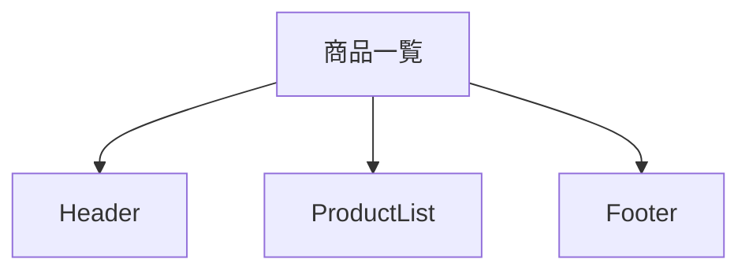
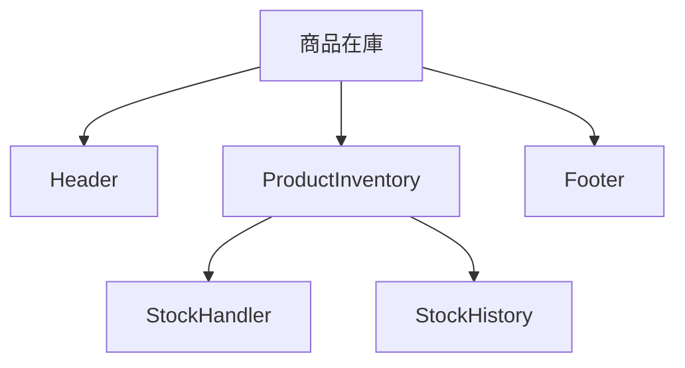

# full-stack-web-development-frontend

```sh
yarn --version
  # 1.22.22
npx --version
  # 10.9.0
node --version
  # v22.12.0
```

## プロジェクト構成





## アプリケーションを作成する

```sh
yarn create next-app frontend
✔ Would you like to use TypeScript? … No / [Yes]
✔ Would you like to use ESLint? … No / [Yes]
✔ Would you like to use Tailwind CSS? … No / [Yes]
✔ Would you like your code inside a `src/` directory? … No / [Yes]
✔ Would you like to use App Router? (recommended) … No / [Yes]
✔ Would you like to use Turbopack for `next dev`? … [No] / Yes
✔ Would you like to customize the import alias (`@/*` by default)? … [No] / Yes
```

> - yarn はデフォルトでは最新のバージョンのテンプレートを使用する
> - タイミングによってバージョンの変更により構成が変わることもあるので、今回は `npx create-next-app` で環境を合わせる。
> - この場合 `yarn create next-app frontend` の実行は不要
>
> ```sh
> npx create-next-app@15.1.4 frontend --use-yarn
> ✔ Would you like to use TypeScript? … No / [Yes]
> ✔ Would you like to use ESLint? … No / [Yes]
> ✔ Would you like to use Tailwind CSS? … No / [Yes]
> ✔ Would you like your code inside a `src/` directory? … No / [Yes]
> ✔ Would you like to use App Router? (recommended) … No / [Yes]
> ✔ Would you like to use Turbopack for `next dev`? … [No] / Yes
> ✔ Would you like to customize the import alias (`@/*` by default)? … [No] / Yes
> ```

## ホットリロード対応

devcontainer 環境の場合、ソースコードの変更を検知出来ない場合があるため、WATCHPACK_POLLING 環境変数を設定。<br>
また、turbopack によるビルドでは検知できなかったため、無効（webpack）で実行させるように設定を変更。

```json
{
  "scripts": {
    "dev": "WATCHPACK_POLLING=true next dev"
  }
}
```

## API モック対応

API のモックとして、json-server を利用。
yarn で起動させるために、`package.json` に以下の設定を追加。

```json
{
  "scripts": {
    "json-server": "json-server --watch data.json --port 3001"
  }
}
```

## 開発環境を起動

```sh
yarn json-server
```

```sh
yarn dev
```
