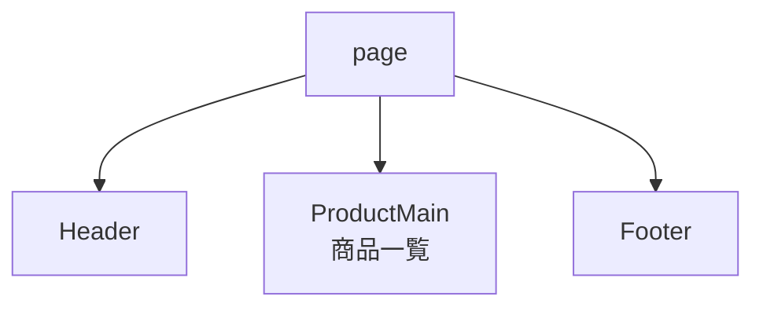
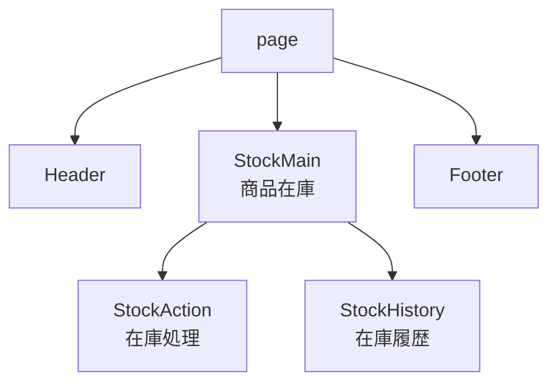
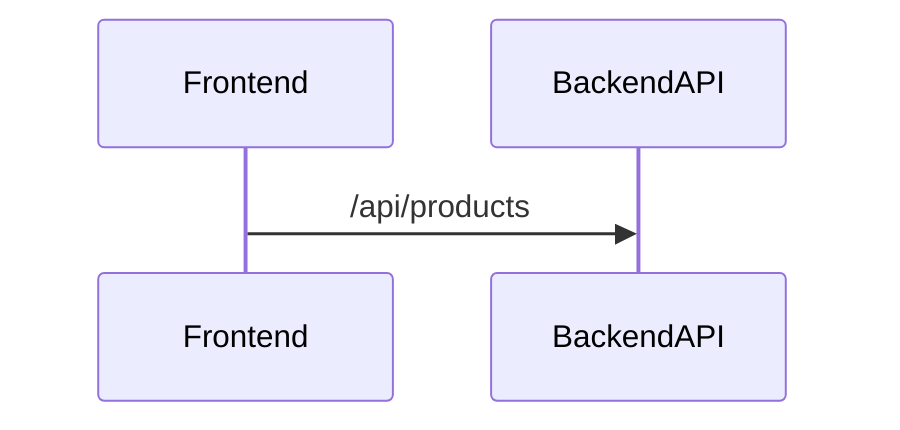
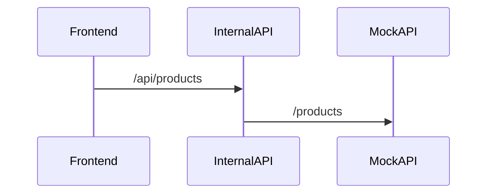

# full-stack-web-development-frontend

```sh
yarn --version
  # 1.22.22
npx --version
  # 10.9.0
node --version
  # v22.12.0
```

## アプリケーションを作成する

```sh
yarn create next-app frontend
✔ Would you like to use TypeScript? … No / [Yes]
✔ Would you like to use ESLint? … No / [Yes]
✔ Would you like to use Tailwind CSS? … No / [Yes]
✔ Would you like your code inside a `src/` directory? … No / [Yes]
✔ Would you like to use App Router? (recommended) … No / [Yes]
✔ Would you like to use Turbopack for `next dev`? … [No] / Yes
✔ Would you like to customize the import alias (`@/*` by default)? … [No] / Yes
```

> - yarn はデフォルトでは最新のバージョンのテンプレートを使用する
> - タイミングによってバージョンの変更により構成が変わることもあるので、今回は `npx create-next-app` で環境を合わせる。
> - この場合 `yarn create next-app frontend` の実行は不要
>
> ```sh
> npx create-next-app@15.1.4 frontend --use-yarn
> ✔ Would you like to use TypeScript? … No / [Yes]
> ✔ Would you like to use ESLint? … No / [Yes]
> ✔ Would you like to use Tailwind CSS? … No / [Yes]
> ✔ Would you like your code inside a `src/` directory? … No / [Yes]
> ✔ Would you like to use App Router? (recommended) … No / [Yes]
> ✔ Would you like to use Turbopack for `next dev`? … [No] / Yes
> ✔ Would you like to customize the import alias (`@/*` by default)? … [No] / Yes
> ```

## ホットリロード対応

devcontainer 環境の場合、ソースコードの変更を検知出来ない場合があるため、WATCHPACK_POLLING 環境変数を設定。<br>
また、turbopack によるビルドでは検知できなかったため、無効（webpack）で実行させるように設定を変更。

```json
{
  "scripts": {
    "dev": "WATCHPACK_POLLING=true next dev"
  }
}
```

## API モック対応

API のモックとして、json-server を利用。

```sh
yarn add -D json-server@0.17.4
```

yarn で起動させるために、`package.json` に以下の設定を追加。

```json
{
  "scripts": {
    "json-server": "json-server --watch data.json --port 3001 --host 0.0.0.0"
  }
}
```

## フォーマッタ

```sh
yarn add -D @biomejs/biome
```

```sh
yarn biome init
```

biome.json

```json
{
  "$schema": "https://biomejs.dev/schemas/1.9.4/schema.json",
  "vcs": {
    "enabled": false,
    "clientKind": "git",
    "useIgnoreFile": false
  },
  "files": {
    "ignoreUnknown": false,
    "ignore": []
  },
  "formatter": {
    "enabled": true,
    "indentStyle": "space"
  },
  "organizeImports": {
    "enabled": true
  },
  "linter": {
    "enabled": true,
    "rules": {
      "recommended": true
    }
  },
  "javascript": {
    "formatter": {
      "quoteStyle": "double"
    }
  }
}
```

- formatter.indentStyle: tab -> space

## 開発環境を起動

```sh
yarn json-server
```

```sh
yarn dev
```

### コンポーネント関連図

**商品一覧**



**商品在庫**



### 内部 API とモック API の関連図

- 実際はバックエンド API と接続するが、開発環境においては、モック API を利用する。
- 但し、バックエンド API とモック API とではインタフェースが異なる為、内部 API を介して接続させる。

**本番環境**



**開発環境**


